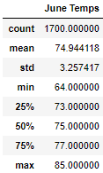
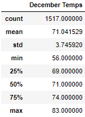
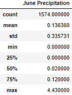
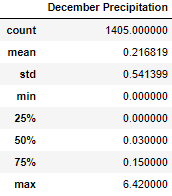

# surfs_up

## Overview of the analysis: 
For this analysis, W. Avy requested information about temperature trends before he decides to open a surf and ice cream shop on Hawaii. We used SQLAlchemy to query information about the temperatures from the months of June and December to get the summary statistics for the temperatures of those months.

## Results:
 - The average temperatures for June and December were 74.9 and 71 degrees, respectfully.
 - The highest temperatures for June and December were 85 and 83 degrees, respectfully.
 - the lowest temperatures for June and December were 64 and 56 degrees, respectfully.

Shown below are the summary statistics for the June and December temperature, respectively.

 

## Summary:
From looking at the temperatures for a hot month (June) and a cold month (December), it seems that the temperature of the island doesn't vary very much, and that the surf and ice cream shop should not be hindered by temperature, regardless of the time of year. Within our Hawaii data, we have precipitation mesurements. We can also look at the summary statistics for the June and December months. 

Shown below are the summary statistics for June and December precipitation, respectively. 

 